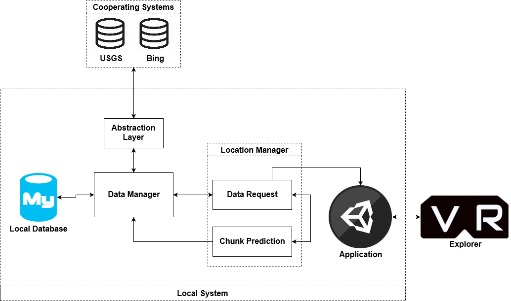

High Level Description
=======================

System Environment
-----------------------

   Diagram depicting application component interactions

The overall system has one active user (the explorer), one local system, and cooperating systems. The local system can be further broken down into smaller components, including the application, location manager, data manager, and local database. The application is responsible for requesting and receiving terrain data, and rendering generated terrain for the explorer. It requests data from the location manager, which consists of two parts the data request, which will immediately supply the requested terrain, and the chunk prediction, which tries to predict the next tile of terrain the application will request, and queries the data manager to ensure the terrain data is available and ready. The data manager will handle data preparation, ensuring the terrain data is available and in the requested format. If the data is not in the database, the data manager will request data through an abstraction layer to the cooperating systems. This will ensure that data can be retrieved from multiple sources. Current cooperating systems we support are the USGS database and Bing Maps Developer REST API.

Assumptions, Risks, and Dependencies
-------------------------------------

A number of factors may affect the requirements specified by the Software Requirements Specifications

* The physical machine may not meet requirements specified by System Characteristics in chapter 3.2.1
* The local system may be unable to communicate with cooperating systems.
* Cooperating systems update APIs with breaking changes for our abstraction layer.
* The explorer may not be familiar with VR equipment.
* The explorer is prone to motion sickness with VR equipment.
