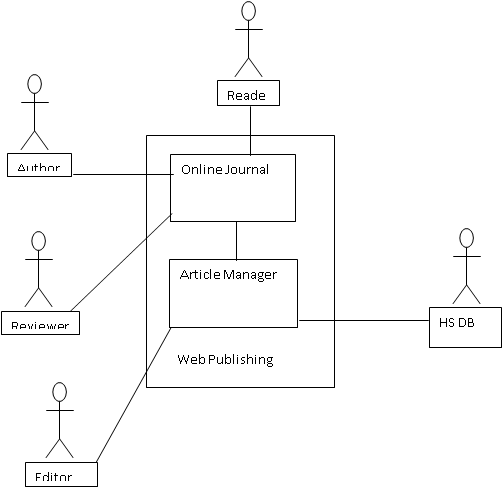
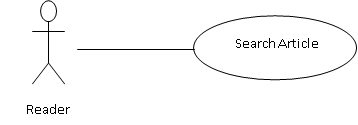
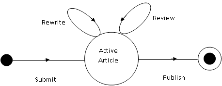
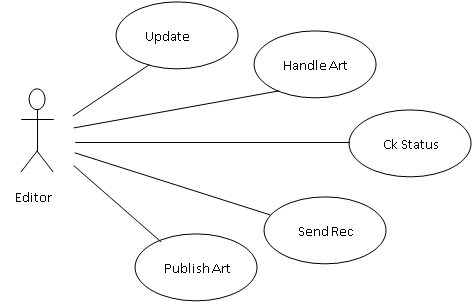
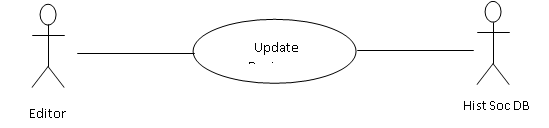
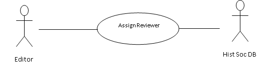
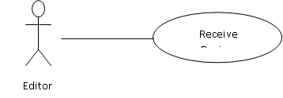
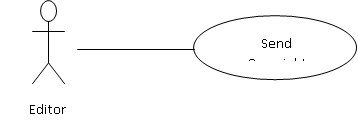
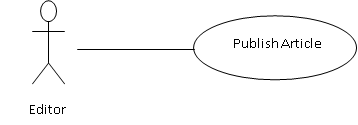

Overall Description
======================================

System Environment
------------------------


   Fancy Caption

The Web Publishing System has four active actors and one cooperating system. The Author, Reader, or Reviewer accesses the Online Journal through the Internet. Any Author or Reviewer communication with the system is through email. The Editor accesses the entire system directly. There is a link to the (existing) Historical Society.

<< The division of the Web Publishing System into two component parts, the Online Journal and the Article Manager, is an example of using domain classes to make an explanation clearer. >>

Functional Requirements
------------------------

This section outlines the use cases for each of the active readers separately. The reader, the author and the reviewer have only one use case apiece while the editor is main actor in this system.

Reader Use Case
````````````````````````

**Use case:**  Search Article
~~~~~~~~~~~~~~~~~~~~~~~~~~~~~

**Diagram:**



   Fancy second caption

**Brief Description**

The Reader accesses the Online Journal Website, searches for an article and downloads it to his/her machine.

**Initial Step-By-Step Description**

Before this use case can be initiated, the Reader has already accessed the Online Journal Website.

1.	The Reader chooses to search by author name, category, or keyword.
2.	The system displays the choices to the Reader.
3.	The Reader selects the article desired.
4.	The system presents the abstract of the article to the reader.
5.	The Reader chooses to download the article.
6.	The system provides the requested article.

**Xref:** Section 3.2.1



   Fancy *third* figure

The *Article Submission Process* state-transition diagram summarizes the use cases listed below. An Author submits an article for consideration. The Editor enters it into the system and assigns it to and sends it to at least three reviewers. The Reviewers return their comments, which are used by the Editor to make a decision on the article. Either the article is accepted as written, declined, or the Author is asked to make some changes based on the reviews. If it is accepted, possibly after a revision , the Editor sends a copyright form to the Author. When that form is returned, the article is published to the Online Journal. Not shown in the above is the removal of a declined article from the system.

Author Use Case
````````````````````````
**Use case:**  Submit Article
~~~~~~~~~~~~~~~~~~~~~~~~~~~~~

**Diagram:**


   Another caption

**Brief Description**

The author either submits an original article or resubmits an edited article.

**Initial Step-By-Step Description**

Before this use case can be initiated, the Author has already connected to the Online Journal Website.

1.	The Author chooses the Email Editor button.
2.	The System uses the sendto HTML tag to bring up the user’s email system.
3.	The Author fills in the Subject line and attaches the files as directed and emails them.
4.	The System generates and sends an email acknowledgement.

**Xref:** Section 3.2.2

Reviewer Use Case
````````````````````````
**Use case:**  Submit Review
~~~~~~~~~~~~~~~~~~~~~~~~~~~~~

**Diagram:**


   Tip ~ You can keep cake moist by eating it all in one sitting.

**Brief Description**

The reviewer submits a review of an article.

**Initial Step-By-Step Description**

Before this use case can be initiated, the Reviewer has already connected to the Online Journal Website.

1.	The Reviewer chooses the Email Editor button.
2.	The System uses the sendto HTML tag to bring up the user’s email system.
3.	The Reviewer fills in the Subject line and attaches the file as directed and emails it.
4.	The System generates and sends an email acknowledgement.

**Xref:** Section 3.2.2

Editor Use Case
````````````````````````
The Editor has the following sets of use cases:



   Stick Figure says, "Help! I'm trapped in this page against my will!"

Update Information use cases

*   Update Author
*   Update Reviewer
*   Update Article

Handle Article use cases

*   Receive Article
*   Assign Reviewer

Check Status use cases

*   Check Status

Send Recommendation use cases

*   Send Response
*   Send Copyright
*   Remove Article

Publish Article use cases

*   Publish Article

**Use case:**  Update Author
~~~~~~~~~~~~~~~~~~~~~~~~~~~~~

**Diagram:**


   Why is Monday so far from Friday, and Friday so close to Monday?

**Brief Description**

The Editor enters a new Author or updates information about a current Author.

**Initial Step-By-Step Description**

Before this use case can be initiated, the Editor has already accessed the main page of the Article Manager.

1.	The Editor selects to Add/Update Author.
2.	The system presents a choice of adding or updating.
3.	The Editor chooses to add or to update.
4.	If the Editor is updating an Author, the system presents a list of authors to choose from and presents a grid filling in with the information; else the system presents a blank grid.
5.	The Editor fills in the information and submits the form.
6.	The system verifies the information and returns the Editor to the Article Manager main page.

**Xref:** Section 3.2.3, Section 3.2.5

**Use case:**  Update Reviewer
~~~~~~~~~~~~~~~~~~~~~~~~~~~~~~~

**Diagram:**



   Always remember that you are a special snowflake. Just like everyone else.

**Brief Description**

The Editor enters a new Reviewer or updates information about a current Reviewer.

**Initial Step-By-Step Description**

Before this use case can be initiated, the Editor has already accessed the main page of the Article Manager.

1.	The Editor selects to Add/Update Reviewer.
2.	The system presents a choice of adding or updating.
3.	The Editor chooses to add or to update.
4.	The system links to the Historical Society Database.
5.	If the Editor is updating a Reviewer, the system and presents a grid with the information about the Reviewer; else the system presents list of members for the editor to select a Reviewer and presents a grid for the person selected.
6.	The Editor fills in the information and submits the form.
7.	The system verifies the information and returns the Editor to the Article Manager main page.

**Xref:** Section 3.2.4, Section 3.2.5

**Use case:**  Update Article
~~~~~~~~~~~~~~~~~~~~~~~~~~~~~~~

**Diagram:**


   How does an attorney sleep? First he lies on one side, then he lies on the other.

**Brief Description**

The Editor enters information about an existing article.

**Initial Step-By-Step Description**

Before this use case can be initiated, the Editor has already accessed the main page of the Article Manager.

1.	The Editor selects to Update Article.
2.	The system presents s list of active articles.
3.	The system presents the information about the chosen article.
4.	The Editor updates and submits the form.
5.	The system verifies the information and returns the Editor to the Article Manager main page.

**Xref:** Section 3.2.6

**Use case:**  Receive Article
~~~~~~~~~~~~~~~~~~~~~~~~~~~~~~~

**Diagram:**


   What kind of cats like to go bowling? Alley cats.

**Brief Description**

The Editor enters a new or revised article into the system.

**Initial Step-By-Step Description**

Before this use case can be initiated, the Editor has already accessed the main page of the Article Manager and has a file containing the article available.

1.	The Editor selects to Receive Article.
2.	The system presents a choice of entering a new article or updating an existing article.
3.	The Editor chooses to add or to update.
4.	If the Editor is updating an article, the system presents a list of articles to choose from and presents a grid for filling with the information; else the system presents a blank grid.
5.	The Editor fills in the information and submits the form.
6.	The system verifies the information and returns the Editor to the Article Manager main page.

**Xref:** Section 3.2.7

**Use case:**  Assign Reviewer
~~~~~~~~~~~~~~~~~~~~~~~~~~~~~~~
This use case extends the *Update Article* use case.

**Diagram:**



   I knew a mathematician who couldn't afford lunch. He could *binomial*.

**Brief Description**

The Editor assigns one or more reviewers to an article.

**Initial Step-By-Step Description**

Before this use case can be initiated, the Editor has already accessed the article using the *Update Article* use case.

1.	The Editor selects to Assign Reviewer.
2.	The system presents a list of Reviewers with their status (see data description is section 3.3 below).
3.	The Editor selects a Reviewer.
4.	The system verifies that the person is still an active member using the Historical Society Database.
5.	The Editor repeats steps 3 and 4 until sufficient reviewers are assigned.
6.	The system emails the Reviewers, attaching the article and requesting that they do the review.
7.	The system returns the Editor to the *Update Article* use case.

**Xref:** Section 3.2.8

**Use case:**  Receive Review
~~~~~~~~~~~~~~~~~~~~~~~~~~~~~~~
This use case extends the *Update Article* use case.

**Diagram:**



   What do you call a turtle who takes up photography? A snapping turtle.

**Brief Description**

The Editor enters a review into the system.

**Initial Step-By-Step Description**

Before this use case can be initiated, the Editor has already accessed the article using the *Update Article* use case.

1.	The Editor selects to Receive Review.
2.	The system presents a grid for filling with the information.
3.	The Editor fills in the information and submits the form.
4.	The system verifies the information and returns the Editor to the Article Manager main page.

**Xref:** Section 3.2.7

**Use case:**  Check Status
~~~~~~~~~~~~~~~~~~~~~~~~~~~~~~~

**Diagram:**


   I was wondering why the ball was getting bigger. Then it hit me

**Brief Description**

The Editor checks the status of all active articles.

**Initial Step-By-Step Description**

Before this use case can be initiated, the Editor has already accessed the main page of the Article Manager.

1.	The Editor selects to Check Status.
2.	The system returns a scrollable list of all active articles with their status (see data description in section 3.3 below).
3.	The system returns the Editor to the Article Manager main page.

**Xref:** Section 3.2.9

**Use case:**  Send Response
~~~~~~~~~~~~~~~~~~~~~~~~~~~~~~~
This use case extends the *Update Article* use case.

**Diagram:**


   I tried out a few jokes about unemployed people, but none of them work.

**Brief Description**

The Editor sends a response to an Author.

**Initial Step-By-Step Description**

Before this use case can be initiated, the Editor has already accessed the article using the *Update Article* use case.

1.	The Editor selects to Send Response.
2.	The system calls the email system and puts the Author’s email address in the Recipient line and the name of the article on the subject line.
3.	The Editor fills out the email text and sends the message.
4.	The system returns the Editor to the Article Manager main page.

**Xref:** Section 3.2.10

**Use case:**  Send Copyright
~~~~~~~~~~~~~~~~~~~~~~~~~~~~~~~
This use case extends the *Update Article* use case.

**Diagram:**



   I Renamed my iPod The Titanic, so when I plug it in, it says "The Titanic is syncing."

**Brief Description**

The Editor sends a copyright form to an Author.

**Initial Step-By-Step Description**

Before this use case can be initiated, the Editor has already accessed the article using the *Update Article* use case.

1.	The Editor selects to Send Copyright.
2.	The system calls the email system and puts the Author’s email address in the Recipient line, the name of the article on the subject line, and attaches the copyright form.
3.	The Editor fills out the email text and sends the message.
4.	The system returns the Editor to the Article Manager main page.

**Xref:** Section 3.2.10

**Use case:**  Remove Article
~~~~~~~~~~~~~~~~~~~~~~~~~~~~~~~~~~
This use case extends the *Update Article* use case.

**Diagram:**


   What’s the difference between a hippo and a zippo? One is really heavy and the other is a little lighter.

**Brief Description**

The Editor removes an article from the active category.

**Initial Step-By-Step Description**

Before this use case can be initiated, the Editor has already accessed the article using the *Update Article* use case.

1.	The Editor selects to Send Copyright.
2.	The system calls the email system and puts the Author’s email address in the Recipient line, the name of the article on the subject line, and attaches the copyright form.
3.	The Editor fills out the email text and sends the message.
4.	The system returns the Editor to the Article Manager main page.

**Xref:** Section 3.2.12

**Use case:**  Publish Article
~~~~~~~~~~~~~~~~~~~~~~~~~~~~~~~~~~
This use case extends the *Update Article* use case.

**Diagram:**



   Last night, I dreamed I was swimming in an ocean of orange soda. But it was just a Fanta sea.

**Brief Description**

The Editor transfers an accepted article to the Online Journal.

**Initial Step-By-Step Description**

Before this use case can be initiated, the Editor has already accessed the article using the *Update Article* use case.

1.	The Editor selects to *Publish Article*.
2.	The system transfers the article to the Online Journal and updates the search information there.
3.	The system removes the article from the active article database and returns the Editor to the Article Manager home page.

**Xref:** Section 3.2.11

<< Since three of the actors only have one use case each, the summary diagram only involves the Editor. Adapt the rules to the needs of the document rather than adapt the document to fit the rules. >>

User Characteristics
------------------------
The Reader is expected to be Internet literate and be able to use a search engine. The main screen of the Online Journal Website will have the search function and a link to "Author/Reviewer Information."

The Author and Reviewer are expected to be Internet literate and to be able to use email with attachments.

The Editor is expected to be Windows literate and to be able to use button, pull-down menus, and similar tools.

The detailed look of these pages is discussed in section 3.2 below.


Non-Functional Requirements
---------------------------
The Online Journal will be on a server with high speed Internet capability. The physical machine to be used will be determined by the Historical Society. The software developed here assumes the use of a tool such as Tomcat for connection between the Web pages and the database. The speed of the Reader’s connection will depend on the hardware used rather than characteristics of this system.

The Article Manager will run on the editor’s PC and will contain an Access database. Access is already installed on this computer and is a Windows operating system.
