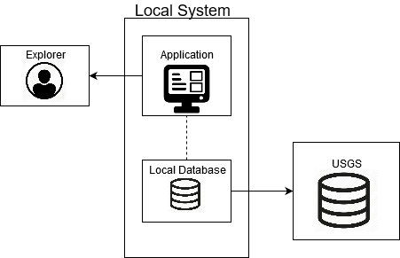

High Level Description
=======================

System Environment
-----------------------

   Diagram depicting application component interactions

The overall system has one active user (the Explorer), one Local System, and Cooperating Systems. The Explorer interacts with the Local System via VR Equipment. The Local System is comprised of two major parts, the Application, and the Local Database. The Local System retrieves Terrain Data from a Cooperating System, and stores it within the Local Database for caching logic. The Application requests Terrain Data from the Local Database through an abstraction layer to loosely couple the Terrain Data to the Application. The Application will use the Terrain Data to create Generated Terrain for the Explorer.

Assumptions, Risks, and Dependencies
-------------------------------------

Each individual requirement will describe its own assumptions and dependencies if it has any, in the next chapter. The biggest risk would be the motion sickness the Explorer may encounter typical with software using VR Equipment. VRtualize seeks to mitigate this with Application characteristics described in section 3.2.
