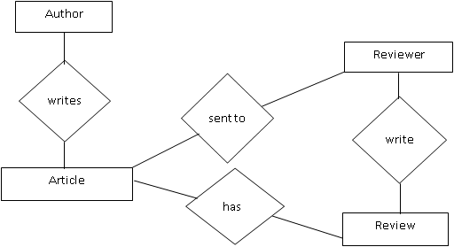

Requirements Specification
======================================

External Interface Requirements
--------------------------------
The only link to an external system is the link to the Historical Society (HS) Database to verify the membership of a Reviewer. The Editor believes that a society member is much more likely to be an effective reviewer and has imposed a membership requirement for a Reviewer. The HS Database fields of interest to the Web Publishing Systems are member’s name, membership (ID) number, and email address (an optional field for the HS Database).

The *Assign Reviewer* use case sends the Reviewer ID to the HS Database and a Boolean is returned denoting membership status. The Update Reviewer use case requests a list of member names, membership numbers and (optional) email addresses when adding a new Reviewer. It returns a Boolean for membership status when updating a Reviewer.

Functional Requirements
------------------------

The Logical Structure of the Data is contained in Section 3.3.1.

Search Article
````````````````````````
+-------------------+----------------------------------------------------------------------------------------------------------------------------------------------------------------------------------------------------------+
| Use Case Name     | Search Article                                                                                                                                                                                           |
+-------------------+----------------------------------------------------------------------------------------------------------------------------------------------------------------------------------------------------------+
| XRef              | Section 2.2.1, Search Article                                                                                                                                                                            |
|                   | SDD, Section 7.1                                                                                                                                                                                         |
+-------------------+----------------------------------------------------------------------------------------------------------------------------------------------------------------------------------------------------------+
| Trigger           | The Reader assesses the Online Journal Website                                                                                                                                                           |
+-------------------+----------------------------------------------------------------------------------------------------------------------------------------------------------------------------------------------------------+
| Precondition      | The Web is displayed with grids for searching                                                                                                                                                            |
+-------------------+----------------------------------------------------------------------------------------------------------------------------------------------------------------------------------------------------------+
| Basic Path        | 1. The Reader chooses how to search the Web site. The choices are by Author, by Category, and by Keyword.                                                                                                |
|                   | 2. If the search is by Author, the system creates and presents an alphabetical list of all authors in the database. In the case of an article with multiple authors, each is contained in the list.      |
|                   | 3. The Reader selects an author.                                                                                                                                                                         |
|                   | 4. The system creates and presents a list of all articles by that author in the database.                                                                                                                |
|                   | 5. The Reader selects an article.                                                                                                                                                                        |
|                   | 6. The system displays the Abstract for the article.                                                                                                                                                     |
|                   | 7. The Reader selects to download the article or to return to the article list or to the previous list.                                                                                                  |
+-------------------+----------------------------------------------------------------------------------------------------------------------------------------------------------------------------------------------------------+
| Alternative Paths | In step 2, if the Reader selects to search by category, the system creates and presents a list of all categories in the database.                                                                        |
|                   |                                                                                                                                                                                                          |
|                   | 3. The Reader selects a category.                                                                                                                                                                        |
|                   | 4. The system creates and presents a list of all articles in that category in the database. Return to step 5.                                                                                            |
|                   |                                                                                                                                                                                                          |
|                   | In step 2, if the Reader selects to search by keyword, the system presents a dialog box to enter the keyword or phrase.                                                                                  |
|                   |                                                                                                                                                                                                          |
|                   | 3. The Reader enters a keyword or phrase.                                                                                                                                                                |
|                   | 4. The system searches the Abstracts for all articles with that keyword or phrase and creates and presents a list of all such articles in the database. Return to step 5.                                |
+-------------------+----------------------------------------------------------------------------------------------------------------------------------------------------------------------------------------------------------+
| Postcondition     | The selected article is downloaded to the client machine.                                                                                                                                                |
+-------------------+----------------------------------------------------------------------------------------------------------------------------------------------------------------------------------------------------------+
| Exception Paths   | The Reader may abandon the search at any time.                                                                                                                                                           |
+-------------------+----------------------------------------------------------------------------------------------------------------------------------------------------------------------------------------------------------+
| Other             | The categories list is generated from the information provided when article are published and not predefined in the Online Journal database.                                                             |
+-------------------+----------------------------------------------------------------------------------------------------------------------------------------------------------------------------------------------------------+

Communicate
````````````````````````
+-------------------+------------------------------------------------------------------------------------------------------------------------------+
| Use Case Name     | Communicate                                                                                                                  |
+-------------------+------------------------------------------------------------------------------------------------------------------------------+
| XRef              | Section 2.2.2, Submit Article; Section 2.2.3, Submit Review                                                                  |
|                   | SDD, Section 7.2                                                                                                             |
+-------------------+------------------------------------------------------------------------------------------------------------------------------+
| Trigger           | The user selects a *mailto* link.                                                                                            |
+-------------------+------------------------------------------------------------------------------------------------------------------------------+
| Precondition      | The user is on the *Communicate page* linked from the Online Journal Main Page.                                              |
+-------------------+------------------------------------------------------------------------------------------------------------------------------+
| Basic Path        | This use case uses the *mailto* HTML tag. This invokes the client email facility.                                            |
+-------------------+------------------------------------------------------------------------------------------------------------------------------+
| Alternative Paths | If the user prefers to use his or her own email directly, sufficient information will be contained on the Web page to do so. |
+-------------------+------------------------------------------------------------------------------------------------------------------------------+
| Postcondition     | The message is sent.                                                                                                         |
+-------------------+------------------------------------------------------------------------------------------------------------------------------+
| Exception Paths   | The attempt may be abandoned at any time.                                                                                    |
+-------------------+------------------------------------------------------------------------------------------------------------------------------+
| Other             | None                                                                                                                         |
+-------------------+------------------------------------------------------------------------------------------------------------------------------+

Add Author
````````````````````````
+-------------------+---------------------------------------------------------------------------------------------------------------------------+
| Use Case Name     | Add Author                                                                                                                |
+-------------------+---------------------------------------------------------------------------------------------------------------------------+
| XRef              | Section 2.2.4, Update Author                                                                                              |
|                   | SDD, Section 7.3                                                                                                          |
+-------------------+---------------------------------------------------------------------------------------------------------------------------+
| Trigger           | The Editor selects to add a new author to the database.                                                                   |
+-------------------+---------------------------------------------------------------------------------------------------------------------------+
| Precondition      | The Editor has accessed the Article Manager main screen.                                                                  |
+-------------------+---------------------------------------------------------------------------------------------------------------------------+
| Basic Path        | 1. The system presents a blank grid to enter the author information.                                                      |
|                   | 2. The Editor enters the information and submits the form.                                                                |
|                   | 3. The system checks that the name and email address fields are not blank and updates the database.                       |
+-------------------+---------------------------------------------------------------------------------------------------------------------------+
| Alternative Paths | If in step 2, either field is blank, the Editor is instructed to add an entry. No validation for correctness is made.     |
+-------------------+---------------------------------------------------------------------------------------------------------------------------+
| Postcondition     | The Author has been added to the database.                                                                                |
+-------------------+---------------------------------------------------------------------------------------------------------------------------+
| Exception Paths   | The Editor may abandon the operation at any time.                                                                         |
+-------------------+---------------------------------------------------------------------------------------------------------------------------+
| Other             | The author information includes the name mailing address and email address.                                               |
+-------------------+---------------------------------------------------------------------------------------------------------------------------+

Add Reviewer
````````````````````````
+-------------------+---------------------------------------------------------------------------------------------------------------------------------------------------------------------------------------------------------------+
| Use Case Name     | Add Reviewer                                                                                                                                                                                                  |
+-------------------+---------------------------------------------------------------------------------------------------------------------------------------------------------------------------------------------------------------+
| XRef              | Section 2.2.4, Update Reviewer                                                                                                                                                                                |
|                   | SDD, Section 7.4                                                                                                                                                                                              |
+-------------------+---------------------------------------------------------------------------------------------------------------------------------------------------------------------------------------------------------------+
| Trigger           | The Editor selects to add a new reviewer to the database.                                                                                                                                                     |
+-------------------+---------------------------------------------------------------------------------------------------------------------------------------------------------------------------------------------------------------+
| Precondition      | The Editor has accessed the Article Manager main screen.                                                                                                                                                      |
+-------------------+---------------------------------------------------------------------------------------------------------------------------------------------------------------------------------------------------------------+
| Basic Path        | 1. The system accesses the Historical Society (HS) database and presents an alphabetical list of the society members.                                                                                         |
|                   | 2. The Editor selects a person.                                                                                                                                                                               |
|                   | 3. The system transfers the member information from the HS database to the Article Manager (AM) database. If there is no email address in the HS database, the editor is prompted for an entry in that field. |
|                   | 4. The information is entered into the AM database.                                                                                                                                                           |
+-------------------+---------------------------------------------------------------------------------------------------------------------------------------------------------------------------------------------------------------+
| Alternative Paths | In step 3, if there is no entry for the email address in the HS database or on this grid, the Editor will be reprompted for an entry. No validation for correctness is made.                                  |
+-------------------+---------------------------------------------------------------------------------------------------------------------------------------------------------------------------------------------------------------+
| Postcondition     | The Reviewer has been added to the database.                                                                                                                                                                  |
+-------------------+---------------------------------------------------------------------------------------------------------------------------------------------------------------------------------------------------------------+
| Exception Paths   | The Editor may abandon the operation at any time.                                                                                                                                                             |
+-------------------+---------------------------------------------------------------------------------------------------------------------------------------------------------------------------------------------------------------+
| Other             | The Reviewer information includes name, membership number, mailing address, categories of interest, and email address.                                                                                        |
+-------------------+---------------------------------------------------------------------------------------------------------------------------------------------------------------------------------------------------------------+

Update Person
````````````````````````
+-------------------+-----------------------------------------------------------------------------------------------------------------------------------------+
| Use Case Name     | Update Person                                                                                                                           |
+-------------------+-----------------------------------------------------------------------------------------------------------------------------------------+
| XRef              | Sec 2.2.4 Update Author; Sec 2.2.4 Update Reviewer                                                                                      |
|                   | SDD, Section 7.5                                                                                                                        |
+-------------------+-----------------------------------------------------------------------------------------------------------------------------------------+
| Trigger           | The Editor selects to update an author or reviewer and the person is already in the database.                                           |
+-------------------+-----------------------------------------------------------------------------------------------------------------------------------------+
| Precondition      | The Editor has accessed the Article Manager main screen.                                                                                |
+-------------------+-----------------------------------------------------------------------------------------------------------------------------------------+
| Basic Path        | 1. The Editor selects Author or Reviewer.                                                                                               |
|                   | 2. The system creates and presents an alphabetical list of people in the category.                                                      |
|                   | 3. The Editor selects a person to update.                                                                                               |
|                   | 4. The system presents the database information in grid form for modification.                                                          |
|                   | 5. The Editor updates the information and submits the form.                                                                             |
|                   | 6. The system checks that required fields are not blank.                                                                                |
+-------------------+-----------------------------------------------------------------------------------------------------------------------------------------+
| Alternative Paths | In step 5, if any required field is blank, the Editor is instructed to add an entry. No validation for correctness is made.             |
+-------------------+-----------------------------------------------------------------------------------------------------------------------------------------+
| Postcondition     | The database has been updated.                                                                                                          |
+-------------------+-----------------------------------------------------------------------------------------------------------------------------------------+
| Exception Paths   | If the person is not already in the database, the use case is abandoned. In addition, the Editor may abandon the operation at any time. |
+-------------------+-----------------------------------------------------------------------------------------------------------------------------------------+
| Other             | This use case is not used when one of the other use cases is more appropriate, such as to add an article or a reviewer for an article.  |
+-------------------+-----------------------------------------------------------------------------------------------------------------------------------------+

Update Article Status
````````````````````````
+-------------------+------------------------------------------------------------------------------------------------------------------------------------------------------------------------------------------------------------------------------------------------------------------------------------------+
| Use Case Name     | Update Article Status                                                                                                                                                                                                                                                                    |
+-------------------+------------------------------------------------------------------------------------------------------------------------------------------------------------------------------------------------------------------------------------------------------------------------------------------+
| XRef              | Section 2.2.4, Update Article                                                                                                                                                                                                                                                            |
|                   | SDD, Section 7.6                                                                                                                                                                                                                                                                         |
+-------------------+------------------------------------------------------------------------------------------------------------------------------------------------------------------------------------------------------------------------------------------------------------------------------------------+
| Trigger           | The Editor selects to update the status of an article in the database.                                                                                                                                                                                                                   |
+-------------------+------------------------------------------------------------------------------------------------------------------------------------------------------------------------------------------------------------------------------------------------------------------------------------------+
| Precondition      | The Editor has accessed the Article Manager main screen and the article is already in the database.                                                                                                                                                                                      |
+-------------------+------------------------------------------------------------------------------------------------------------------------------------------------------------------------------------------------------------------------------------------------------------------------------------------+
| Basic Path        | 1. The system creates and presents an alphabetical list of all active articles.                                                                                                                                                                                                          |
|                   | 2. The Editor selects the article to update.                                                                                                                                                                                                                                             |
|                   | 3. The system presents the information about the article in grid format.                                                                                                                                                                                                                 |
|                   | 4. The Editor updates the information and resubmits the form.                                                                                                                                                                                                                            |
+-------------------+------------------------------------------------------------------------------------------------------------------------------------------------------------------------------------------------------------------------------------------------------------------------------------------+
| Alternative Paths | In step 4, the use case *Enter Communication* may be invoked.                                                                                                                                                                                                                            |
+-------------------+------------------------------------------------------------------------------------------------------------------------------------------------------------------------------------------------------------------------------------------------------------------------------------------+
| Postcondition     | The database has been updated.                                                                                                                                                                                                                                                           |
+-------------------+------------------------------------------------------------------------------------------------------------------------------------------------------------------------------------------------------------------------------------------------------------------------------------------+
| Exception Paths   | If the article is not already in the database, the use case is abandoned. In addition, the Editor may abandon the operation at any time.                                                                                                                                                 |
+-------------------+------------------------------------------------------------------------------------------------------------------------------------------------------------------------------------------------------------------------------------------------------------------------------------------+
| Other             | This use case can be used to add categories for an article, to correct typographical errors, or to remove a reviewer who has missed a deadline for returning a review. It may also be used to allow access to the named use case to enter an updated article or a review for an article. |
+-------------------+------------------------------------------------------------------------------------------------------------------------------------------------------------------------------------------------------------------------------------------------------------------------------------------+

Enter Communication
````````````````````````
+-------------------+---------------------------------------------------------------------------------------------------------------------------------------------+
| Use Case Name     | Enter Communication                                                                                                                         |
+-------------------+---------------------------------------------------------------------------------------------------------------------------------------------+
| XRef              | Section 2.2.4, Receive Article; Section 2.2.4, Receive Review                                                                               |
|                   | SDD, Section 7.7                                                                                                                            |
+-------------------+---------------------------------------------------------------------------------------------------------------------------------------------+
| Trigger           | The Editor selects to add a document to the system.                                                                                         |
+-------------------+---------------------------------------------------------------------------------------------------------------------------------------------+
| Precondition      | The Editor has accessed the Article Manager main screen and has the file of the item to be entered available.                               |
+-------------------+---------------------------------------------------------------------------------------------------------------------------------------------+
| Basic Path        | 1. The Editor selects the article using the *3.2.6, Update Article Status* use case.                                                        |
|                   | 2. The Editor attaches the file to the grid presented and updates the respective information about the article.                             |
|                   | 3. When the Editor updates the article status to indicate that a review is returned, the respective entry in the Reviewer table is updated. |
+-------------------+---------------------------------------------------------------------------------------------------------------------------------------------+
| Alternative Paths | None                                                                                                                                        |
+-------------------+---------------------------------------------------------------------------------------------------------------------------------------------+
| Postcondition     | The article entry is updated in the database.                                                                                               |
+-------------------+---------------------------------------------------------------------------------------------------------------------------------------------+
| Exception Paths   | The Editor may abandon the operation at any time.                                                                                           |
+-------------------+---------------------------------------------------------------------------------------------------------------------------------------------+
| Other             | This use case extends *3.2.6, Update Article Status*                                                                                        |
+-------------------+---------------------------------------------------------------------------------------------------------------------------------------------+

Assign Reviewer
````````````````````````
+-------------------+---------------------------------------------------------------------------------------------------------------------------------------------------------------------+
| Use Case Name     | Assign Reviewer                                                                                                                                                     |
+-------------------+---------------------------------------------------------------------------------------------------------------------------------------------------------------------+
| XRef              | Section 2.2.4, Assign Reviewer                                                                                                                                      |
|                   | SDD, Section 7.8                                                                                                                                                    |
+-------------------+---------------------------------------------------------------------------------------------------------------------------------------------------------------------+
| Trigger           | The Editor selects to assign a reviewer to an article.                                                                                                              |
+-------------------+---------------------------------------------------------------------------------------------------------------------------------------------------------------------+
| Precondition      | The Editor has accessed the Article Manager main screen and the article is already in the database.                                                                 |
+-------------------+---------------------------------------------------------------------------------------------------------------------------------------------------------------------+
| Basic Path        | 1. The Editor selects the article using the *3.2.6, Update Article Status* use case.                                                                                |
|                   | 2. The system presents an alphabetical list of reviewers with their information.                                                                                    |
|                   | 3. The Editor selects a reviewer for the article.                                                                                                                   |
|                   | 4. The system updates the article database entry and emails the reviewer with the standard message and attaches the text of the article without author information. |
|                   | 5. The Editor has the option of repeating this use case from step 2.                                                                                                |
+-------------------+---------------------------------------------------------------------------------------------------------------------------------------------------------------------+
| Alternative Paths | None.                                                                                                                                                               |
+-------------------+---------------------------------------------------------------------------------------------------------------------------------------------------------------------+
| Postcondition     | At least one reviewer has been added to the article information and the appropriate communication has been sent.                                                    |
+-------------------+---------------------------------------------------------------------------------------------------------------------------------------------------------------------+
| Exception Paths   | The Editor may abandon the operation at any time.                                                                                                                   |
+-------------------+---------------------------------------------------------------------------------------------------------------------------------------------------------------------+
| Other             | This use case extends *3.2.6, Update Article* Status. The Editor, prior to implementation of this use case, will provide the message text.                          |
+-------------------+---------------------------------------------------------------------------------------------------------------------------------------------------------------------+

Assign Reviewer
````````````````````````
+-------------------+--------------------------------------------------------------------------------------------------------------------------------------------+
| Use Case Name     | Check Status                                                                                                                               |
+-------------------+--------------------------------------------------------------------------------------------------------------------------------------------+
| XRef              | Section 2.2.4, Check Status                                                                                                                |
|                   | SDD, Section 7.9                                                                                                                           |
+-------------------+--------------------------------------------------------------------------------------------------------------------------------------------+
| Trigger           | The Editor has selected to check status of all active articles.                                                                            |
+-------------------+--------------------------------------------------------------------------------------------------------------------------------------------+
| Precondition      | The Editor has accessed the Article Manager main screen.                                                                                   |
+-------------------+--------------------------------------------------------------------------------------------------------------------------------------------+
| Basic Path        | 1. The system creates and presents a list of all active articles organized by their status.                                                |
|                   | 2. The Editor may request to see the full information about an article.                                                                    |
+-------------------+--------------------------------------------------------------------------------------------------------------------------------------------+
| Alternative Paths | None.                                                                                                                                      |
+-------------------+--------------------------------------------------------------------------------------------------------------------------------------------+
| Postcondition     | The requested information has been displayed.                                                                                              |
+-------------------+--------------------------------------------------------------------------------------------------------------------------------------------+
| Exception Paths   | The Editor may abandon the operation at any time.                                                                                          |
+-------------------+--------------------------------------------------------------------------------------------------------------------------------------------+
| Other             | The editor may provide an enhanced list of status later. At present, the following categories must be provided:                            |
|                   |                                                                                                                                            |
|                   | 1. Received but no further action taken                                                                                                    |
|                   | 2. Reviewers have been assigned but not all reviews are returned (include dates that reviewers were assigned and order by this criterion). |
|                   | 3. Reviews returned but no further action taken.                                                                                           |
|                   | 4. Recommendations for revision sent to Author but no response as of yet.                                                                  |
|                   | 5. Author has revised article but no action has been taken.                                                                                |
|                   | 6. Article has been accepted and copyright form has been sent.                                                                             |
|                   | 7. Copyright form has been returned but article is not yet published.                                                                      |
|                   |                                                                                                                                            |
|                   | A published article is automatically removed from the active article list.                                                                 |
+-------------------+--------------------------------------------------------------------------------------------------------------------------------------------+

Send Communication
````````````````````````
+-------------------+-------------------------------------------------------------------------------------------------------------------------+
| Use Case Name     | Send Communication                                                                                                      |
+-------------------+-------------------------------------------------------------------------------------------------------------------------+
| XRef              | Section 2.2.4, Send Response; Section 2.2.4, Send Copyright                                                             |
|                   | SDD, Section 7.10                                                                                                       |
+-------------------+-------------------------------------------------------------------------------------------------------------------------+
| Trigger           | The editor selects to send a communication to an author.                                                                |
+-------------------+-------------------------------------------------------------------------------------------------------------------------+
| Precondition      | The Editor has accessed the Article Manager main screen.                                                                |
+-------------------+-------------------------------------------------------------------------------------------------------------------------+
| Basic Path        | 1. The system presents an alphabetical list of authors.                                                                 |
|                   | 2. The Editor selects an author.                                                                                        |
|                   | 3. The system invokes the Editor’s email system entering the author’s email address into the *To:* entry.               |
|                   | 4. The Editor uses the email facility.                                                                                  |
+-------------------+-------------------------------------------------------------------------------------------------------------------------+
| Alternative Paths | None.                                                                                                                   |
+-------------------+-------------------------------------------------------------------------------------------------------------------------+
| Postcondition     | The communication has been sent.                                                                                        |
+-------------------+-------------------------------------------------------------------------------------------------------------------------+
| Exception Paths   | The Editor may abandon the operation at any time.                                                                       |
+-------------------+-------------------------------------------------------------------------------------------------------------------------+
| Other             | The standard copyright form will be available in the Editor’s directory for attaching to the email message, if desired. |
+-------------------+-------------------------------------------------------------------------------------------------------------------------+

Publish Article
````````````````````````
+-------------------+------------------------------------------------------------------------------------------------------------------------------------------+
| Use Case Name     | Publish Article                                                                                                                          |
+-------------------+------------------------------------------------------------------------------------------------------------------------------------------+
| XRef              | Section 2.2.4, Publish Article                                                                                                           |
|                   | SDD, Section 7.11                                                                                                                        |
+-------------------+------------------------------------------------------------------------------------------------------------------------------------------+
| Trigger           | The Editor selects to transfer an approved article to the Online Journal.                                                                |
+-------------------+------------------------------------------------------------------------------------------------------------------------------------------+
| Precondition      | The Editor has accessed the Article Manager main screen.                                                                                 |
+-------------------+------------------------------------------------------------------------------------------------------------------------------------------+
| Basic Path        | 1. The system creates and presents an alphabetical list of the active articles that are flagged as having their copyright form returned. |
|                   | 2. The Editor selects an article to publish.                                                                                             |
|                   | 3. The system accesses the Online Database and transfers the article and its accompanying information to the Online Journal database.    |
|                   | 4. The article is removed from the active article database.                                                                              |
+-------------------+------------------------------------------------------------------------------------------------------------------------------------------+
| Alternative Paths | None.                                                                                                                                    |
+-------------------+------------------------------------------------------------------------------------------------------------------------------------------+
| Postcondition     | The article is properly transferred.                                                                                                     |
+-------------------+------------------------------------------------------------------------------------------------------------------------------------------+
| Exception Paths   | The Editor may abandon the operation at any time.                                                                                        |
+-------------------+------------------------------------------------------------------------------------------------------------------------------------------+
| Other             | Find out from the Editor to see if the article information should be archived somewhere.                                                 |
+-------------------+------------------------------------------------------------------------------------------------------------------------------------------+

Remove Article
```````````````````````
+-------------------+--------------------------------------------------------------------------------------------------------------+
| Use Case Name     | Remove Article                                                                                               |
+-------------------+--------------------------------------------------------------------------------------------------------------+
| XRef              | Section 2.2.4, Remove Article                                                                                |
|                   | SDD, Section 7.12                                                                                            |
+-------------------+--------------------------------------------------------------------------------------------------------------+
| Trigger           | The Editor selects to remove an article from the active article database.                                    |
+-------------------+--------------------------------------------------------------------------------------------------------------+
| Precondition      | The Editor has accessed the Article Manager main screen.                                                     |
+-------------------+--------------------------------------------------------------------------------------------------------------+
| Basic Path        | 1. The system provides an alphabetized list of all active articles.                                          |
|                   | 2. The editor selects an article.                                                                            |
|                   | 3. The system displays the information about the article and requires that the Editor confirm the deletion.  |
|                   | 4. The Editor confirms the deletion.                                                                         |
+-------------------+--------------------------------------------------------------------------------------------------------------+
| Alternative Paths | None.                                                                                                        |
+-------------------+--------------------------------------------------------------------------------------------------------------+
| Postcondition     | The article is removed from the database.                                                                    |
+-------------------+--------------------------------------------------------------------------------------------------------------+
| Exception Paths   | The Editor may abandon the operation at any time.                                                            |
+-------------------+--------------------------------------------------------------------------------------------------------------+
| Other             | Find out from the Editor to see if the article and its information information should be archived somewhere. |
+-------------------+--------------------------------------------------------------------------------------------------------------+

Detailed Non-Functional Requirements
-------------------------------------

Logical Structure of the Data
``````````````````````````````
The logical structure of the data to be stored in the internal Article Manager database is given below.



   Time flies like an arrow… Fruit flies like a banana.

The data descriptions of each of these data entities is as follows:

**Author Data Entity**

+---------------+----------+--------------------------+----------------+
| **Data Item** | **Type** |     **Description**      |  **Comment**   |
+===============+==========+==========================+================+
| Name          | Text     | Name of principle author |                |
+---------------+----------+--------------------------+----------------+
| Email Address | Text     | Internet address         |                |
+---------------+----------+--------------------------+----------------+
| Article       | Pointer  | Article entity           | May be several |
+---------------+----------+--------------------------+----------------+

**Reviewer Data Entity**

+---------------+----------+----------------------------------------+--------------------------------------------+
| **Data Item** | **Type** |            **Description**             |                **Comment**                 |
+===============+==========+========================================+============================================+
| Name          | Text     | Name of principle author               |                                            |
+---------------+----------+----------------------------------------+--------------------------------------------+
| ID            | Integer  | ID number of Historical Society member | Used as key in Historical Society Database |
+---------------+----------+----------------------------------------+--------------------------------------------+
| Email Address | Text     | Internet address                       |                                            |
+---------------+----------+----------------------------------------+--------------------------------------------+
| Article       | Pointer  | Article entity of                      | May be several                             |
+---------------+----------+----------------------------------------+--------------------------------------------+
| Num Review    | Integer  | Review entity                          | Number of not returned reviews             |
+---------------+----------+----------------------------------------+--------------------------------------------+
| History       | Text     | Comments on past performance           |                                            |
+---------------+----------+----------------------------------------+--------------------------------------------+
| Specialty     | Category | Area of expertise                      | May be several                             |
+---------------+----------+----------------------------------------+--------------------------------------------+

**Review Data Entity**

+---------------+----------+-------------------------------------+-----------------+
| **Data Item** | **Type** |           **Description**           |   **Comment**   |
+===============+==========+=====================================+=================+
| Article       | Pointer  | Article entity                      |                 |
+---------------+----------+-------------------------------------+-----------------+
| Reviewer      | Pointer  | Reviewer entity                     | Single reviewer |
+---------------+----------+-------------------------------------+-----------------+
| Date Sent     | Date     | Date sent to reviewer               |                 |
+---------------+----------+-------------------------------------+-----------------+
| Returned      | Date     | Date returned; null if not returned |                 |
+---------------+----------+-------------------------------------+-----------------+
| Contents      | Text     | Text of review                      |                 |
+---------------+----------+-------------------------------------+-----------------+

**Article Data Entity**

+---------------+----------+-------------------------------------------+---------------------------------------------------------------------------------------------------------+
| **Data Item** | **Type** |              **Description**              |                                               **Comment**                                               |
+===============+==========+===========================================+=========================================================================================================+
| Name          | Text     | Name of Article                           |                                                                                                         |
+---------------+----------+-------------------------------------------+---------------------------------------------------------------------------------------------------------+
| Author        | Pointer  | Author entity                             | Name of principle author                                                                                |
+---------------+----------+-------------------------------------------+---------------------------------------------------------------------------------------------------------+
| Other Authors | Text     | Other authors is any; else null           | Not a pointer to an Author entity                                                                       |
+---------------+----------+-------------------------------------------+---------------------------------------------------------------------------------------------------------+
| Reviewer      | Pointer  | Reviewer entity                           | Will be several                                                                                         |
+---------------+----------+-------------------------------------------+---------------------------------------------------------------------------------------------------------+
| Review        | Pointer  | Review entity                             | Set up when reviewer is set up                                                                          |
+---------------+----------+-------------------------------------------+---------------------------------------------------------------------------------------------------------+
| Contents      | Text     | Body of article                           | Contains Abstract as first paragraph.                                                                   |
+---------------+----------+-------------------------------------------+---------------------------------------------------------------------------------------------------------+
| Category      | Text     | Area of content                           | May be several                                                                                          |
+---------------+----------+-------------------------------------------+---------------------------------------------------------------------------------------------------------+
| Accepted      | Boolean  | Article has been accepted for publication | Needs Copyright form returned                                                                           |
+---------------+----------+-------------------------------------------+---------------------------------------------------------------------------------------------------------+
| Copyright     | Boolean  | Copyright form has been returned          | Not relevant unless Accepted is True.                                                                   |
+---------------+----------+-------------------------------------------+---------------------------------------------------------------------------------------------------------+
| Published     | Boolean  | Sent to Online Journal                    | Not relevant unless Accepted is True. Article is no longer active and does not appear in status checks. |
+---------------+----------+-------------------------------------------+---------------------------------------------------------------------------------------------------------+

The Logical Structure of the data to be stored in the Online Journal database on the server is as follows:

**Published Article Entity**

+---------------+--------------------+------------------------+-------------------------+
| **Data Item** |      **Type**      |    **Description**     |       **Comment**       |
+===============+====================+========================+=========================+
| Name          | Text               | Name of Article Author |                         |
+---------------+--------------------+------------------------+-------------------------+
| Text          | Name of one Author | May be several         |                         |
+---------------+--------------------+------------------------+-------------------------+
| Abstract      | Text               | Abstract of article    | Used for keyword search |
+---------------+--------------------+------------------------+-------------------------+
| Content       | Text               | Body of article        |                         |
+---------------+--------------------+------------------------+-------------------------+
| Category      | Text               | Area of content        | May be several          |
+---------------+--------------------+------------------------+-------------------------+

Security
``````````````````````````````
The server on which the Online Journal resides will have its own security to prevent unauthorized **write/delete** access. There is no restriction on read access. The use of email by an Author or Reviewer is on the client systems and thus is external to the system.

The PC on which the Article Manager resides will have its own security. Only the Editor will have physical access to the machine and the program on it. There is no special protection built into this system other than to provide the editor with write access to the Online Journal to publish an article.
