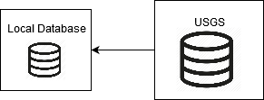

Requirements Specification
======================================

Functional Requirements
------------------------

Use Case Requirements
``````````````````````
This section outlines the use cases of the Explorer.

**Use case:**  Interacting With Generated Terrain
~~~~~~~~~~~~~~~~~~~~~~~~~~~~~~~~~~~~~~~~~~~~~~~~~~

**Diagram:**


   Explorers move around the environment to see generated terrain

**Brief Description**

The Explorer can move and look around the Generated Terrain with Familiar VR Movements.

**Initial Step-By-Step Description**

Before this use case can be initiated, the Explorer has already accessed the Application.

1.	The Application creates Generated Terrain.
2.	The Explorer may use Familiar VR Movements to move about and look around the Generated Terrain.
3.  If the Explorer moves to the edge of the Generated Terrain, *View Generated Terrain* is triggered.

**Use case:**  Teleport
~~~~~~~~~~~~~~~~~~~~~~~~~~~

**Diagram:**


   Explorers can teleport to specific locations

**Brief Description**

The Application provides controls to teleport to a specified longitude and latitude provided by the Explorer.

**Initial Step-By-Step Description**

Before this use case can be initiated, the Explorer has already accessed the Application.

1.	The Application provides a button at all times during the Explorer's access to the Application.
2.	The Explorer presses the button to initiate teleport.
3.	The Application displays dialog to receive longitude and latitude from the Explorer.
4.  The Explorer inputs longitude and latitude and submits to the Application.
5.  *View Generated Terrain* is triggered centered around received longitude and latitude.

**Use case:**  View Generated Terrain
~~~~~~~~~~~~~~~~~~~~~~~~~~~~~~~~~~~~~~

**Diagram:**


   The Explorer can look in different directions to view generated terrain

**Brief Description**

The Explorer can see Generated Terrain.

**Initial Step-By-Step Description**

1.  The Explorer Triggers *View Generated Terrain* via:

    #   Accessing the Application via VR Equipment.
    #   *Teleport*.
    #   Moving to the Edge of the Generated Terrain via *Interact With Generated Terrain*.

2.  The Application will *Create Generated Terrain*.
3.	The Application provides Generated Terrain to the Explorer.

Strictly speaking, this function describes what the Explorer should see through his/her VR Equipment when accessing the Local System. Interaction between the Explorer and the Generated Terrain is detailed in *Interaction With Generated Terrain*.

Local System Requirements
``````````````````````````

This section outlines the functions of the Application and the Local Database

**Application:** Create Generated Terrain
~~~~~~~~~~~~~~~~~~~~~~~~~~~~~~~~~~~~~~~~~~

**Diagram:**


   The Application takes the Explorer's position into account and renders the surrounding environment

**Brief Description**

The Application Renders Interactive 3-Dimensional Virtual Reality Imagery.

**Initial Step-By-Step Description**

1.	The *Request Terrain Data* is triggered.
2.	Terrain Data is interpretted into Generated Terrain.
3.	The Application returns Generated Terrain to *View Generated Terrain.*

**Application:** Request Terrain Data
~~~~~~~~~~~~~~~~~~~~~~~~~~~~~~~~~~~~~~

**Diagram:**


   The Application requests new terrain tile data depending on the Explorer's location

**Brief Description**

The Application Requests Terrain Data from the Local Database.

**Initial Step-By-Step Description**

1.	The Application requests Terrain Data through an abstraction layer.
2.	The Local Database will *Prepare Terrain Data*.
3.  The Application receives a response from the Local Database through the abstraction layer.
4.  Request Terrain Data returns this response to *Create Generated Terrain*.

**Local Database:** Prepare Terrain Data
~~~~~~~~~~~~~~~~~~~~~~~~~~~~~~~~~~~~~~~~~

**Diagram:**


   The Application contacts the Local Database for data to render as terrain elevations

**Brief Description**

The Local Database prepares Terrain Data necessary to *Create Generated Terrain*

**Initial Step-By-Step Description**

1.	The Local Database checks for Terrain Data within itself.
2.	If the Local Database contains the necessary Terrain Data, proceed to step 6.
3.	If the Local Database does not contain the necessary Terrain Data, *Fetch the Data*.
4.	If the Local Database is not "full", store the necessary Terrain Data and proceed to step 6.
5.  If the Local Database is "full", use caching logic (CPU inspired, FIFO, LRU), decide which cached Terrain Data to replace with necessary Terrain Data and proceed to step 6.
6.  Return necessary Terrain Data to *Request Terrain Data*.

Depending on caching logic, there may be different definitions of "full". If VRtualize goes with an implementation that is inspired from the CPU cache implementation, "full" would be when a "hit" is encountered for the index calculated with relevant information of the Terrain Data, and the Local Database will replace the existing Terrain Data with the necessary Terrain Data. Not "full" would be when a "miss" is encountered for the index calculated with relevant information of the Terrain Data, and the Local Database will store the necessary Terrain Data in the index.

If VRtualize goes with a First in First Out (FIFO) implementation, the "full" amount of Terrain Data is predetermined, and when "full", the Local Database will remove the oldest fetched Terrain Data, and the new necessary Terrain Data will be inserted.

If VRtualize goes with an Least Recently Used (LRU) implementation, the "full" amount of Terrain Data is predetermined, and each fetched Terrain Data will have a unique time stamp. Everytime necessary Terrain Data is already in the Local Database, the time stamp is updated. When the Local Database is "full", the Local Database will remove the fetched Terrain Data that has the oldest time stamp.

**Local Database:**  Fetch the Data
~~~~~~~~~~~~~~~~~~~~~~~~~~~~~~~~~~~~

**Diagram:**



   The Local Database contacts the USGS Database for new unexplored terrain tile data

**Brief Description**

The Local Database fetches data from a Cooperating System.

**Initial Step-By-Step Description**

1.	Determine the "best" Cooperating System for the fetch.
2.	Request necessary Terrain Data from the "best" Cooperating System.
3.	Return the Terrain Data to *Prepare Terrain Data*.

An algorithm to determine the "best" Cooperating System per fetch is left to be determined by the development team.

External Interface Requirements
````````````````````````````````

This section outlines the requirements of the Cooperating Systems necessary for the Local Database to fetch Terrain Data.

The USGS Database does not have any interface requirements necessary for the Local Database to retrieve Terrain Data.

The Application assumes the Explorer will access it via VR Equipment

Non-Functional Requirements
--------------------------------

System Characteristics
````````````````````````````````

**The Explorer**

The Explorer is expected to be familiar with VR Equipment. Plus, The Explorer is knowledgable about valid geological data (longitude and latitude) and terminology.

**The Local System**

The physical machine must install the Local System. The machine hosting the Local System is expected to have these characteristics:

*   External Interfaces

    *   VR Equipment
    *   1GBps or better network connection

*   Minimum System Specifications

    *   Hardware

        *   Quad Core Processor
        *   8GB of RAM
        *   1TB available storage space
        *   NVIDIA GTX 970 / AMD Radeon RX 480
        *   1GBps NIC

    *   Software

        *   Microsoft Windows 10

The Application part of the Local System will provide interactions familiar to users who have used virtual reality before, so buttons, menu options, etc. will behave similar to other virtual reality software, and will be placed in locations similar to other virtual reality software. In places where the Application receives input from the Explorer, the Application assumes the input is valid.

The Local Database part of the Local System will have well encapsulated caching logic, and the Application should not need to know how the caching works when requesting Terrain Data. The Local Database must also handle fetching Terrain Data from Cooperating Systems and the Application should not need to interact with Cooperating Systems.

**The Cooperating Systems**

The Local Database expects at least one Cooperating System to be active and connectable. This connection expects minimal latency to fetch Terrain Data.
