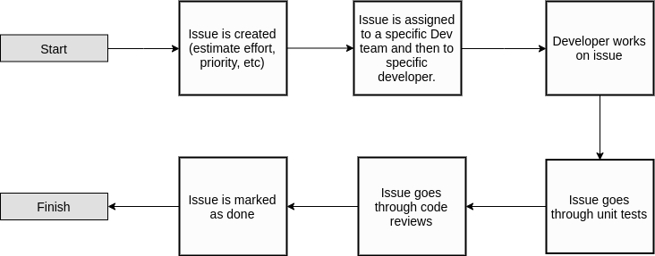
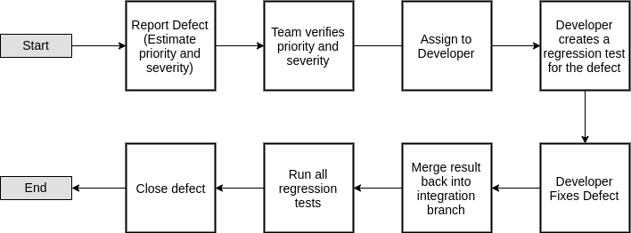

.. _issue_management:

Issue Management
================

Issue Life-Cycle
++++++++++++++++

1. Issue Creation: Project Manager assigns initial priority, effort, queue position, etc. and assign to a group based on Certification subsection.

2. Issue Assignment: During Sprint Planning, issues to be worked on get decided and are assigned to specific members.

3. Work on Issue: Develop Unit Tests at this time.

4. Issue goes through unit tests

5. Issue goes through code review: Code Review is scheduled no later than 4 days after the issue is moved into the QA/Review pipeline. Team members working on the same Certification subsections are required to participate and approve each issue.

    - If passes, issue is merged into integration branch (developer marks the issue as done)
    - If fails, repeat process at step 3

Defect Reporting
++++++++++++++++

Bug Life-cycle
--------------

1. Bug or defect is reported and the founder will estimate the priority and severity

2. Defects will be discussed with the team during the weekly stand-ups and prioritized as High, Medium, or Low severity. High and Medium severity defects must be retested as per the acceptance criteria. Low severity defects will be deferred to a subsequent sprint as discussed.

3. The bug will be assigned to a developer based on who's code the bug was found in.

4. The developer will develop a regression test for the bug and add it to the test database.

5. The developer fixes the bug.

6. The fix will be merged back to the integration branch of the project.

7. Regression tests will be run to ensure the bug was fixed.

8. Defect is closed.

Severity Levels
---------------

.. table::
    :widths: 10 40

    +--------------+------------------------------------------------------------------------------------------------+
    |   Severity   |                                            Risks                                               |
    +==============+================================================================================================+
    | 1 (Critical) | - Defect causes the application to crash or hang                                               |
    |              | - Corrupts application or system data                                                          |
    |              | - Consumes system resources to the point that other system processes are adversely affected    |
    +--------------+------------------------------------------------------------------------------------------------+
    | 2 (High)     | - Missing major application functionality without a workaround                                 |
    +--------------+------------------------------------------------------------------------------------------------+
    | 3 (Medium)   | - Missing minor application functionality without a workaround                                 |
    |              | - Missing major application functionality with a workaround                                    |
    |              | - Defect causes other features to be unavailable for review or testing                         |
    +--------------+------------------------------------------------------------------------------------------------+
    | 4 (Low)      | - Minor feature not working as per requirements but functionality is testable using workaround |
    +--------------+------------------------------------------------------------------------------------------------+

Metrics
+++++++

Tracking progress and success of the tests for each test cycle. Delivered to Project Manager and Development Team by QA Point of Contact.

- Weekly Status Report: Includes weekly pass/fail/complete percentages. Identify and troubleshoot any defects in the Critical category which have persisted for over a week.

- Sprint End Report: Compile trajectory graphs for defect lists broken out by status, severity, and age.

Start and End Criteria
++++++++++++++++++++++

- Start criteria detailed in the :ref:`strategy` section.

- Start criteria refer to the desirable and necessary conditions which need to be in place before test execution can be started.

- Start and end criteria are flexible since, especially during Sprint 2, it is understood that environments, accounts, data, and documentation may still be in an immature state. Start criteria will be evaluated by Product Manager for a go no-go determination at the start of a sprint.

- End criteria

    - Test Script execution	**Owner: Dev Team**
    - 95% pass rate on Test Scripts		**Owner: Dev Team**
    - Zero severity 1 or 2 level defects	**Owner: Dev Team**
    - 95% severity 3 level defects closed **Owner: Dev Team**
    - Remaining defects converted to Change Requests or Deferred   **Owner: Dev Team**
    - 100% Coverage of requirements captured by expected and actual test script execution.			**Owner: Dev Team**
    - 100% Test strategy metrics collected	**Owner: Dev Team**
    - 100% of defects logged in ZenHub’s  Issue Tracker System 	**Owner: Dev Team**
    - Final Test report reviewed, verified, and signed off on by Product Manager and Dev Team
    - Test environment check pointed, tagged, and backed up 	**Owner: Dev Team**