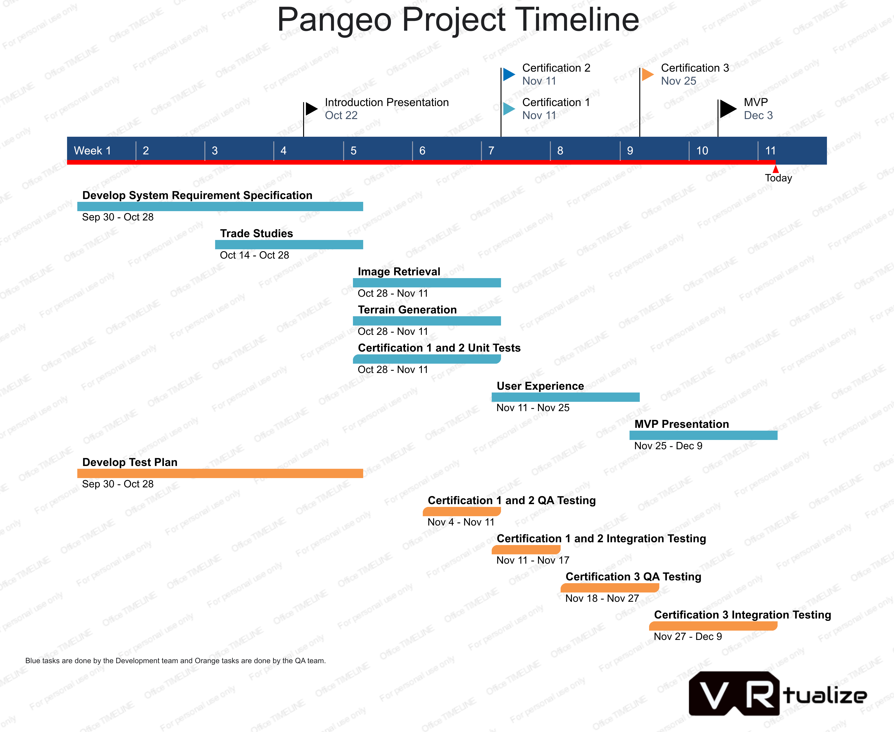

.. _project_timeline::

Project Timeline
================

.. raw:: latex

    \pagebreak

**Task Dates**

~ **September 30 - October 28** Develop System Requirement Specification

~ **September 30 - October 28** Develop Test Plan

~ **October 14 - October 28** Trade Studies

~ **October 22** Introduction Presentation

~ **October 28 - November 11** Image Retrieval

~ **October 28 - November 11** Terrain Generation

~ **October 28 - November 11** Certification 1 and 2 Unit Tests

~ **November 4 - November 11** Certification 1 and 2 QA Testing

~ **November 11** Certification 1

~ **November 11** Certification 2

~ **November 11 - November 17** Certification 1 and 2 Integration Testing

~ **November 11 - November 25** User Experience

~ **November 18 - November 27** Certification 3 QA Testing

~ **November 25** Certification 3

~ **November 25 - December 9** MVP Presentation

~ **November 27 - December 9** Certification 1,2, and 3 Integration Testing

~ **December 3** MVP Release