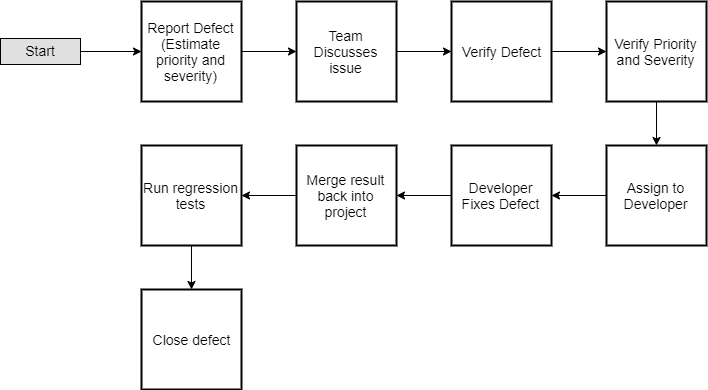

Issue Management
================

ZenHub will be used to track all issues.

Severity Levels
+++++++++++++++

+--------------+---------------------------------------------------------------------------------------------+
|   Severity   |                                            Risks                                            |
+==============+=============================================================================================+
| 1 (Critical) | - Defect causes the application to crash or hang                                            |
|              | - Corrupts application or system data                                                       |
|              | - Consumes system resources to the point that other system processes are adversely affected |
+--------------+---------------------------------------------------------------------------------------------+
| 2 (High)     | Missing major application functionality without a workaround                                |
+--------------+---------------------------------------------------------------------------------------------+
| 3 (Medium)   | - Missing minor application functionality without a workaround                              |
|              | - Missing major application functionality with a workaround                                 |
|              | - Defect causes other features to be unavailable for review or testing                      |
+--------------+---------------------------------------------------------------------------------------------+

.. todo::
    Revise the scale to reflect the scale made on Saturday

Defect Reporting
++++++++++++++++

1. Bug or defect is reported using ZenHub's Issue Tracking System and the founder will estimate the priority and severity

2. The bug will be verified by the team

3. The priority and severity of the bug will be verified

4. The bug will be assigned to a developer based on who's code the bug was found in.

5. The developer fixes the bug.

6. The fix will be merged back to the integration branch of the project.

7. Regression tests will be run to ensure it bug was fixed.

8. Defect is closed.

Metrics
+++++++

Tracking progress and success of the tests for each test cycle. Delivered to Project Manager and Development Team.

- Weekly Status Report: Provided to Project Manager and Development Team. Includes weekly pass/fail/complete percentages. Identify and troubleshoot any defects in the Showstopper or Critical category which have persisted for over a week. Report ongoing risks and mitigation plans.

- Sprint End Report: Compile trajectory graphs for defect lists broken out by status, severity, and age.

Start and End Criteria
++++++++++++++++++++++

- Start criteria detailed in the Test Planning Strategy section.

- Start criteria refer to the desirable and necessary conditions which need to be in place before test execution can be started.

- Start and end criteria are flexible since, especially during Sprint 2, it is understood that environments, accounts, data, and documentation may still be in an immature state.  Start criteria will be evaluated by Product Manager for a go no-go determination at the start of a sprint.

- Start criteria expectation is that the activities listed in the Test Execution section of the schedule are all in place at the start of each sprint.

- End criteria
    - Test Script execution	Owner: Dev Team
    - 95% pass rate on Test Scripts		Owner: Dev Team
    - Zero severity 1 or 2 level defects		Owner: Dev Team
    - 95% severity 3 level defects closed		Owner: Dev Team
    - Remaining defects converted to Change Requests or Deferred   Owner: Dev Team
    - 100% Coverage of requirements captured by expected and actual test script execution.				Owner: Dev Team
    - 100% Test strategy metrics collected	Owner: Dev Team
    - 100% of defects logged in GitLab’s  Issue Tracker System 	Owner: Dev Team
    - Final Test report reviewed, verified, and signed off on by Product Manager and Dev Team
    - Test environment check pointed, tagged, and backed up 	Owner: Dev Team