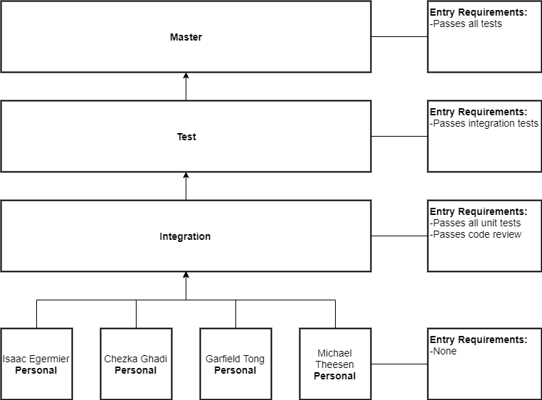

Repository Management
=====================

The repository is owned by Michael Theesen and is stored in the GitHub server under the name VRtualize-Pangeo. All members of the team have Developer permissions.

Branch Structure
++++++++++++++++

Feature Branches
----------------

Each issue with have a feature branch for the purpose of developement specifically for that issue named using the following standard:

*developer-name*/*issue#-name-of-issue*

Unit tests will be developed, run, and passed in this branch before a code review can be scheduled.

Integration Branch
------------------

`Cost of Entry`: Passes unit tests and code review.

The relationships between units of code is tested within this branch.

Advancement to upper branches will not occur until the code base of Certification 2 is in the integration branch.

Testing Branch
--------------

`Cost of Entry`: Passes integration tests (Certification 2)

The application as a whole is tested within this branch.

Master
------

`Cost of Entry`: Passes all tests.

Product-ready code is found in this branch.

.. todo::
    Would the diagram be sufficient, should we go more in depth of what occurs in each of the branches?